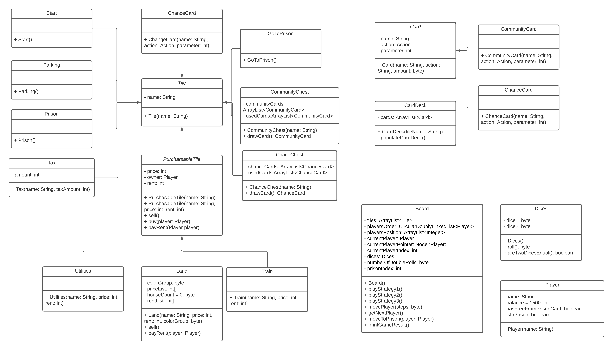

# Java Monopoly
# How to Run
This project is an IntelliJ IDEA Project. To run, download the project, then import to IntelliJ and run.
# Summary of Game
The program is a simulation of the Monopoly game. This game is played by 3 players. The game ends when there is only one player left or when the number of turns reaches 10000. 
The winner is the last player to stay in the game. Players start with $1500 and they get $200 every time they pass the Go square. 
This game has the rules similar to the classic Monopoly game. The rules can be found [here](https://www.hasbro.com/common/instruct/00009.pdf)
However, there are some key differences:
- Trading is not allowed
- The players do not need to purchase all properties in a group to build houses
- The players cannot mortgage their properties

# Class Diagram

